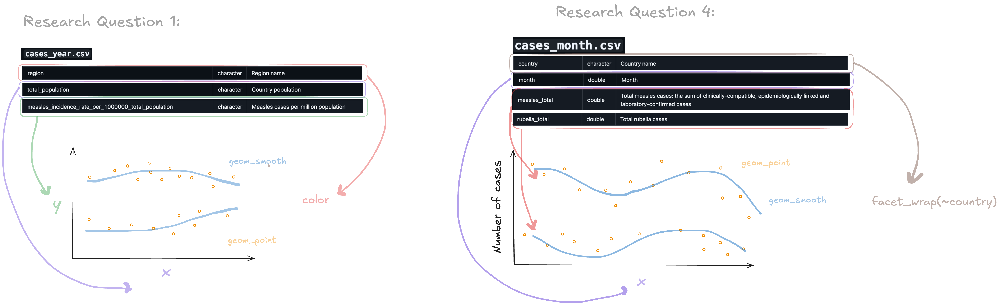

## Data Context
The data includes information on reported cases of measles and rubella. The data was downloaded from the World Health Organization on June 12, 2025. The number of reported measles and rubella cases is collected and reported by WHO member states. Records span multiple years, containing yearly and monthly data across different regions and countries around the world. In the data set, each country is identified by name and ISO3 code. Measles and rubella cases are classified by the following: suspected, clinically-compatible, epidemiologically-linked, and laboratory-confirmed. The data was curated to support analyses in global trends over time such as seasonal patterns of outbreaks, healthcare capacity, and regional measles/rubella burden. From WHO's data collection, the data is cleaned and organized into CSV files.

## Data Cleaning
In the cleaning of the data, the datatypes of the variables in the monthly data set from "year" to "discarded" were converted to numeric so they can be used for calculations and analysis. In both the monthly and yearly data sets, column names are renamed. the clean_names() function is used to convert the names to snake_case. In the monthly data set, some of the columns names were also explicitly renamed so that their names were more descriptive. For example, the variable name "na" was renamed as "measles_lab_confirmed". From the cleaning script, no new variables were created. Variables were modified for organizational purposes and to have more clear and meaningful name. 

## Research Questions with Original Data
1. How does the measles incidence rate relate to total population size across regions?
2. Do measles and rubella cases peak in the same months across countries?

## Research Questions with Supplemental Data
3. How is measles vaccination rate associated with measles incidence rate by region?
4. Are weather (ex: temperature, rainfall) patterns associated with seasonal peaks in measles cases across different regions?

## Data Visualization Sketches
Related to research questions 1 and 2: 

